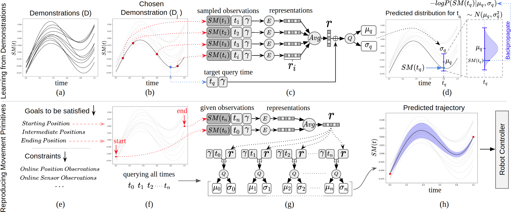

# Conditional Neural Movement Primitives
**This branch includes PyTorch implementation. For Keras/Tensorflow implementation please refer to [Keras](https://github.com/myunusseker/CNMP/tree/Keras) branch**

This repository includes the CNMP implementation and example material from the experiments of the paper:

M. Yunus Seker, Mert Imre, Justus Piater, Emre Ugur, [Conditional Neural Movement Primitives](http://www.roboticsproceedings.org/rss15/p71.pdf), RSS 2019

## What's New ?
  * PyTorch implementation of the framework with:
    * Multi-step/whole-trajectory prediction support
    * Easier data/model organization with a more basic batch-based approach
    * Recreated Experiment 1 from the [paper](http://www.roboticsproceedings.org/rss15/p71.pdf)

### Requirements:

* Python >=3.6
 
* Jupyter Notebook

* PyTorch >=1.6.0

### Contact Information:

* M. Yunus Seker ,  m.yunusseker@hotmail.com, yunus.seker1@boun.edu.tr

* Mert Imre , mert.imre@boun.edu.tr

* Emre Ugur, emre.ugur@boun.edur.tr
